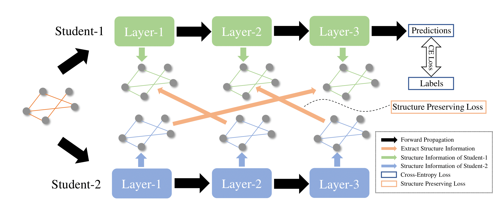

# Alignahead

This repo covers the implementation of the following IJCNN 2022 paper:
Alignahead: Online Cross-Layer Knowledge Extraction on Graph Neural Networks



## Installation
This repo was tested with Python 3.7, PyTorch 1.7.0, CUDA 10.1 and dgl 0.4.2.

## Running
Train multiple student models
``` shell
python main.py --model_num 2 --strategy alignahead --gpu 0 --model_name GAT --a 1
```
where the flags are explained as:
* `--model_num`: the number of student models.
* `--strategy`: the strategy of alignment,[alignahead,OC].
* `--model_name`: the structure of student models.
* `--a`: the hyper-parameter of alignment loss.

## Citation
If you find this repository useful, please consider citing the following paper:
```
@article{guo2022alignahead,
  title={Alignahead: Online Cross-Layer Knowledge Extraction on Graph Neural Networks},
  author={Guo, Jiongyu and Chen, Defang and Wang, Can},
  journal={International Joint Conference on Neural Networks (IJCNN)},
  year={2022}
}

```
